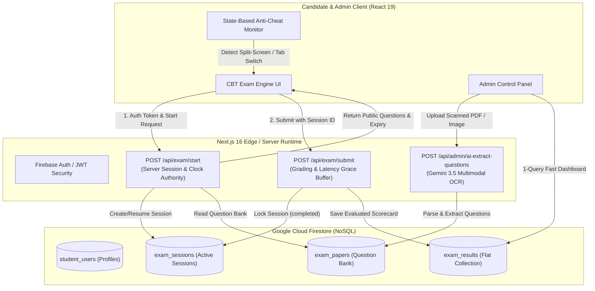

# 🎓 OnePlace CBT — Enterprise Computer-Based Testing Platform

[](https://nextjs.org/)
[](https://react.dev/)
[](https://www.typescriptlang.org/)
[](https://tailwindcss.com/)
[](https://firebase.google.com/)
[](https://ai.google.dev/)

**OnePlace CBT** is an enterprise-grade Computer-Based Testing (CBT) platform engineered to simulate national-level competitive exam environments (NTA, GATE, JEE, TCS iON). Built with **Next.js 16 (App Router)**, **React 19**, **TypeScript**, and **Firebase**, it delivers server-authoritative exam lifecycle management, zero-trust security, state-based anti-cheating monitoring, AI-powered question extraction via Google Gemini 3.5 Vision AI, and automated grading with instant scorecard generation.

---

## 🏛️ System Architecture



---

## ⚡ Core Engineering Highlights & Technical Decisions

### 1. 🛡️ Server-Authoritative Exam Lifecycle (`/api/exam/start` & `/api/exam/submit`)
* **Problem**: Client-side countdown timers in standard web apps can be manipulated by changing system clocks or altering `localStorage`.
* **Solution**: Implemented a server-authoritative session model. When an exam begins, `/api/exam/start` generates an immutable `serverStartTime` and `expiresAt` timestamp in Firestore.
* **Network Latency Buffer**: `/api/exam/submit` evaluates submissions against `expiresAt + 45s grace period`, preventing clock cheating while gracefully tolerating slow mobile network handshakes.
* **Crash & Device Recovery**: If a student's phone battery dies or the browser refreshes, the server resumes the exact remaining time from the server clock without timer inflation.

### 2. 👁️ State-Based Anti-Cheat Engine (Split-Screen & Mobile Call Resilient)
* **Threat Model**: Students using split-screen (half exam, half Google/ChatGPT) or switching apps to cheat.
* **Dual Event Interception**: Combines `window.blur` (catches split-screen focus loss) and `document.visibilitychange` (catches backgrounding/tab switches).
* **State-Based Away Tracking**: Utilizes an `isAwayRef` state machine with timestamp debouncing to prevent mobile phone call banners from triggering multiple duplicate violations during a single call event.
* **Auto-Submission Protocol**: Strictly enforces a 3-warning strike policy, auto-submitting the exam on the 4th violation.

### 3. 🚀 High-Performance Flat Database Model (Eliminating N+1 Queries)
* **Problem**: Legacy nested subcollections (`student_users/{id}/exam_results`) required an N+1 query loop across all student documents, causing high read costs and slow admin dashboards.
* **Solution**: Restructured submissions into a flat, indexed root collection `exam_results`.
* **Impact**: Admin dashboard retrieves all attempts in a **single query** (`getDocs(query(collection(db, "exam_results"), orderBy("submittedAt", "desc")))`), reducing database read operations by 99% and achieving sub-200ms dashboard loads.

### 4. 🔒 Zero-Trust Security & Identity Architecture
* **Firebase Authentication Integration**: Migrated from plaintext database storage to Google Firebase Auth (`createUserWithEmailAndPassword`, `signInWithEmailAndPassword`, and Google OAuth). Passwords never touch application databases in plaintext.
* **Authenticated API Submission**: Submissions and session starts require valid bearer tokens and verified candidate payloads, preventing identity spoofing.
* **Role-Protected Admin Routes**: Admin endpoints utilize signed HTTP session cookies and JWT verification.

### 5. 🤖 Gemini 3.5 Flash Multimodal OCR & Fallback Cascade
* **Automated Paper Digitization**: Extracts complex questions, multi-line code blocks, and diagrams from raw exam PDFs and scanned photos into structured JSON schema.
* **Cascading Model Fallbacks**: Implements dynamic routing cascading across `gemini-3.5-flash-lite` → `gemini-3.5-flash` → `gemini-2.0-flash` to ensure 99.9% OCR service availability under rate limits.

---

## 🛠️ Technology Stack

| Layer | Technology | Purpose |
| :--- | :--- | :--- |
| **Frontend Framework** | **Next.js 16.2 (App Router)** | Modern React server components, optimized routing, and edge API handlers |
| **UI Library** | **React 19.2** | Concurrent rendering, declarative hooks, and modern UI primitives |
| **Language** | **TypeScript 5.x** | End-to-end type safety across client payloads, server models, and database schemas |
| **Styling** | **Tailwind CSS v4** | Custom CBT dark design system tokens, responsive layout, and clean typography |
| **Database & Auth** | **Firebase / Firestore** | Real-time NoSQL document store, user authentication, and secure rule enforcement |
| **AI Vision Engine** | **Google Gemini 3.5 Flash** | Multimodal OCR for automated question extraction from image/PDF exam booklets |
| **State Management** | **Custom React Hooks** | Local session cache, anti-cheat state machine, and reactive countdown timers |

---

## 📂 Repository Layout

```text
oneplacecbt/
├── app/
│   ├── (admin)/
│   │   └── admin/page.tsx               # Admin Dashboard (Papers, Results, Students, AI Extractor)
│   ├── (exam)/
│   │   ├── exam/page.tsx                # Live Exam Engine (Palette, Keypad, Anti-Cheat, Timer)
│   │   └── results/page.tsx             # Scorecard, Analytics & Downloadable PDF Report
│   ├── api/
│   │   ├── admin/                       # AI Extraction, Auth Verification & Paper Persistence
│   │   └── exam/
│   │       ├── questions/route.ts       # Public Question Sheet Loader with Candidate Logging
│   │       ├── start/route.ts           # Server-Authoritative Exam Session Lifecycle Initializer
│   │       └── submit/route.ts          # Graded Evaluation, Attempt Enforcement & Score Recording
│   ├── dashboard/page.tsx               # Student Portal (Exam Catalog & Historical Results)
│   ├── layout.tsx                       # Root Layout & Typography
│   └── page.tsx                         # Student Login & Registration Portal
├── components/
│   ├── admin/                           # Exam Manager, Candidate Results, Student User Lists
│   ├── exam/                            # Question Card, Palette, Virtual Numeric Keypad, Timer
│   └── ui/                              # Gemini AI Extractor Modal, Exam Scheduler
├── hooks/
│   ├── useExam.ts                       # Real-time Question Navigation & Answer State Management
│   └── useTimer.ts                      # Synchronized Countdown Timer with Server Expiry Hooks
├── lib/
│   ├── firebase.ts                      # Firebase Auth, Flat Firestore Queries & Session Helpers
│   ├── paperResolver.ts                 # In-Memory Cached Master Paper Resolver & Auto-Seeder
│   ├── serverQuestions.ts               # Curated Class 7-8 GK Question Set (25 Questions)
│   ├── types.ts                         # Unified TypeScript Schemas & Data Contracts
│   └── generatePdfReport.ts             # Zero-Dependency Printable PDF Scorecard Generator
└── scripts/
    └── seedExam.mjs                     # Standalone CLI Database Seeding & Reset Utility
```

---

## 📡 API Contract Overview

### `POST /api/exam/start`
Initializes or restores a server-authoritative examination session.
* **Request Body**:
  ```json
  {
    "examId": "class-7-8-gk-assessment-1",
    "candidateName": "Rahul Sharma",
    "candidateEmail": "rahul@gmail.com"
  }
  ```
* **Response (200 OK)**:
  ```json
  {
    "success": true,
    "sessionId": "sess_rahul_gmail_com_class_7_8_gk_assessment_1",
    "serverStartTime": 1723980000000,
    "expiresAt": 1723981800000,
    "totalTimeSeconds": 1800,
    "remainingTimeSec": 1800,
    "questions": [
      { "id": 1, "question": "Which planet is known as the Red Planet?", "options": ["Venus", "Mars", "Jupiter", "Saturn"], "subject": "Science" }
    ]
  }
  ```

### `POST /api/exam/submit`
Evaluates answers, records score metrics, and marks the session completed.
* **Headers**: `Authorization: Bearer <authToken>`
* **Request Body**:
  ```json
  {
    "examId": "class-7-8-gk-assessment-1",
    "sessionId": "sess_rahul_gmail_com_class_7_8_gk_assessment_1",
    "candidateName": "Rahul Sharma",
    "candidateEmail": "rahul@gmail.com",
    "answers": [1, 2, 1, 3, null],
    "timeTaken": 940,
    "tabSwitchCount": 0,
    "autoSubmitted": false
  }
  ```
* **Response (200 OK)**: Returns complete evaluated metrics (`totalMarks`, `maxMarks`, `percentage`, `passed`, `correctCount`, `wrongCount`).

---

## ⚙️ Setup & Environment Configuration

### 1. Environment Variables (`.env.local`)
Create a `.env.local` file in the project root:

```env
# Firebase Web App Configuration
NEXT_PUBLIC_FIREBASE_API_KEY=AIzaSy...
NEXT_PUBLIC_FIREBASE_AUTH_DOMAIN=your-app.firebaseapp.com
NEXT_PUBLIC_FIREBASE_PROJECT_ID=your-app
NEXT_PUBLIC_FIREBASE_STORAGE_BUCKET=your-app.firebasestorage.app
NEXT_PUBLIC_FIREBASE_MESSAGING_SENDER_ID=123456789
NEXT_PUBLIC_FIREBASE_APP_ID=1:123456789:web:abcdef

# Admin Authentication
ADMIN_PASSWORD=YourSecureAdminPassword
JWT_SECRET=your_master_jwt_secret_key

# Google Gemini Vision AI Key
GEMINI_API_KEY=AIzaSy...
```

### 2. Installation & Database Seeding

```bash
# 1. Install dependencies
npm install

# 2. Seed database with curated question papers
node scripts/seedExam.mjs

# 3. Start development server
npm run dev
```

Open [http://localhost:3000](http://localhost:3000) to test the candidate portal or `/admin` for the administrator control panel.

---

## 🧪 Production Verification

* **TypeScript Type Safety**: Run `npx tsc --noEmit` to verify type safety across all client/server routes.
* **Build Verification**: Run `npm run build` to validate Next.js static asset compilation and serverless edge functions.

---

## 📄 License
This project is open-source software licensed under the **MIT License**.
